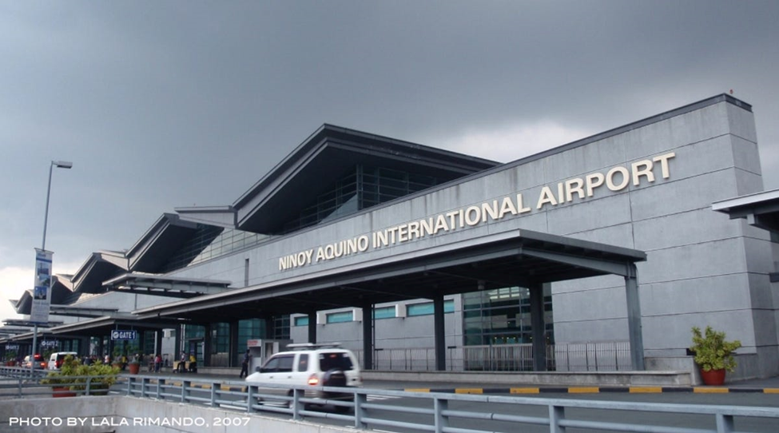
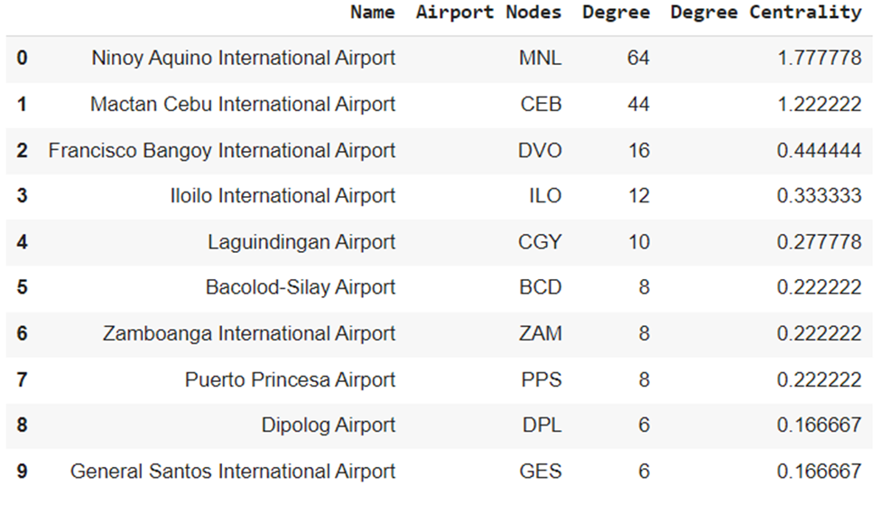
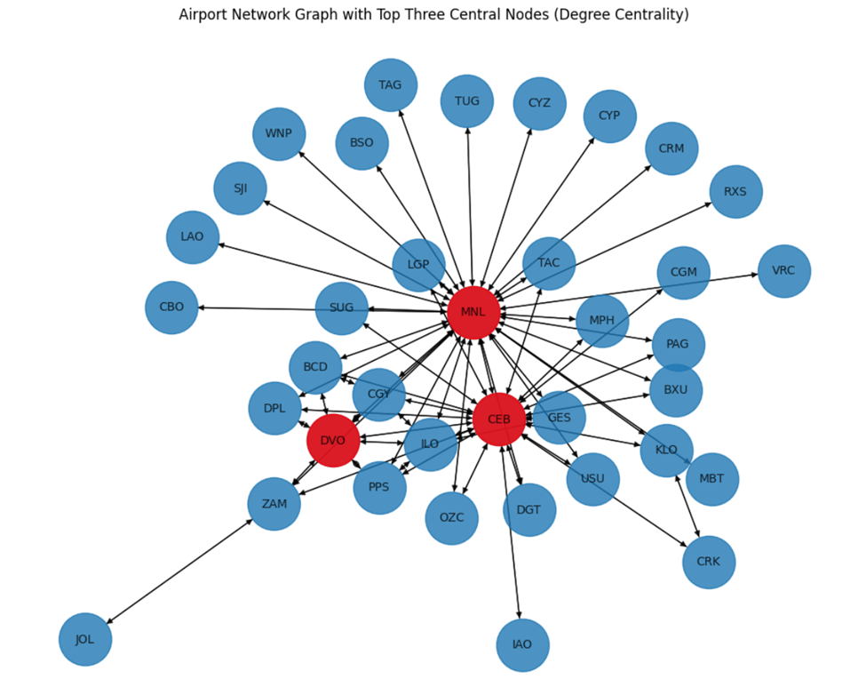
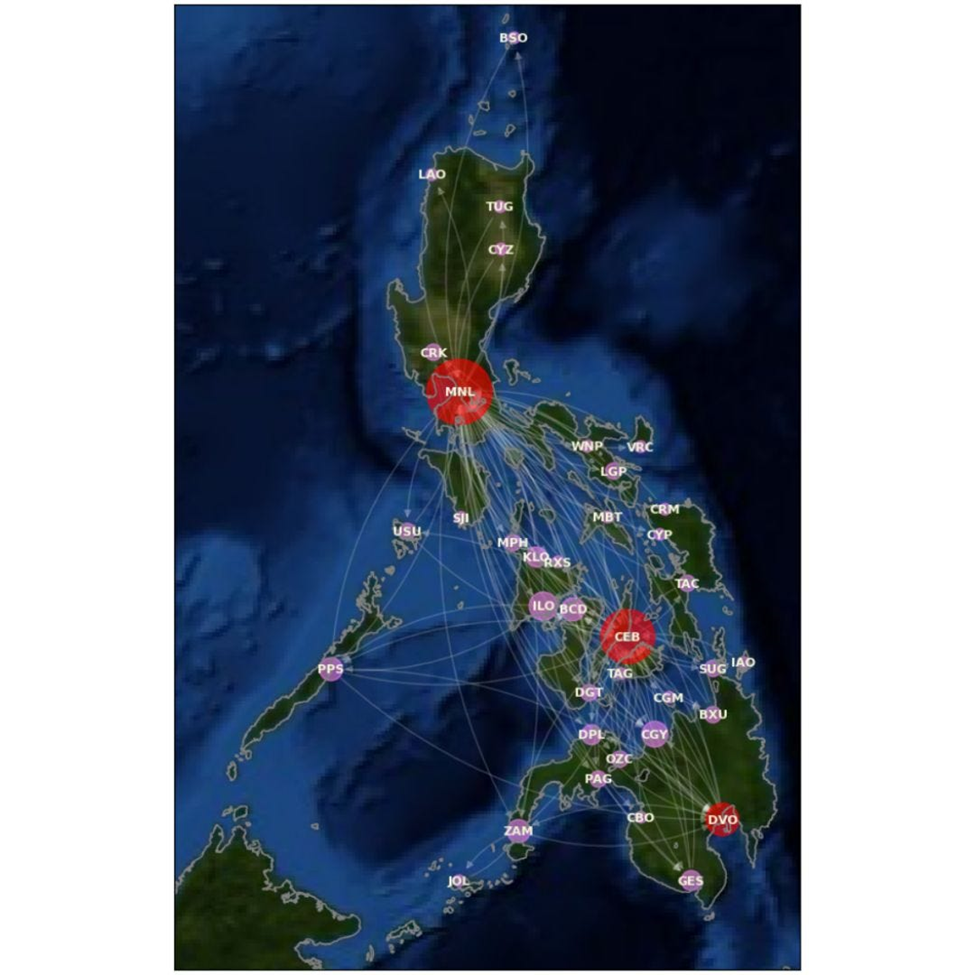
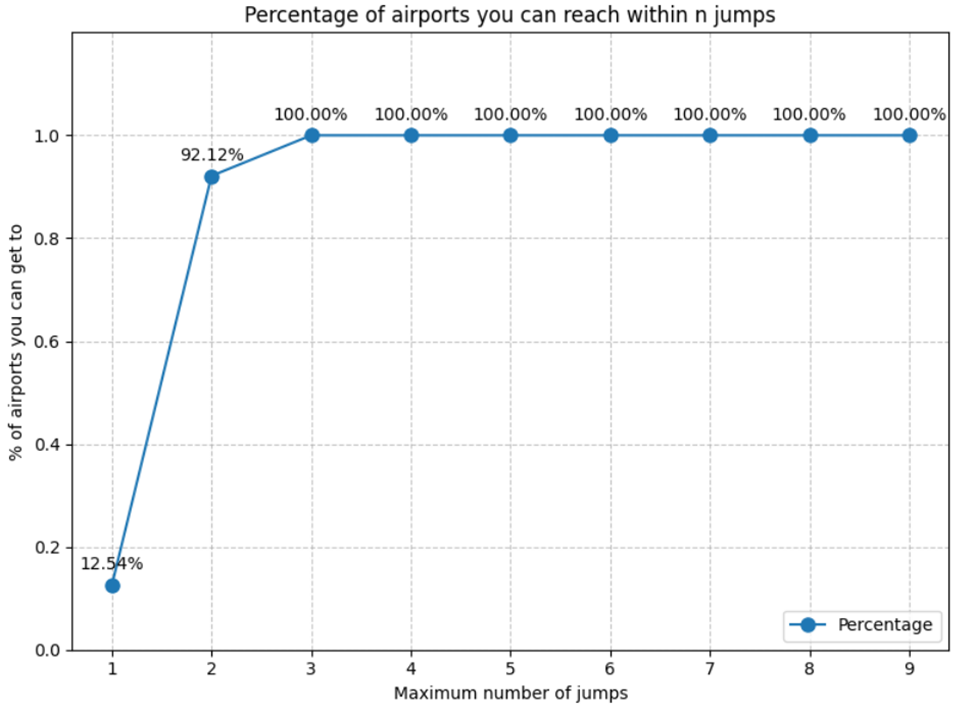
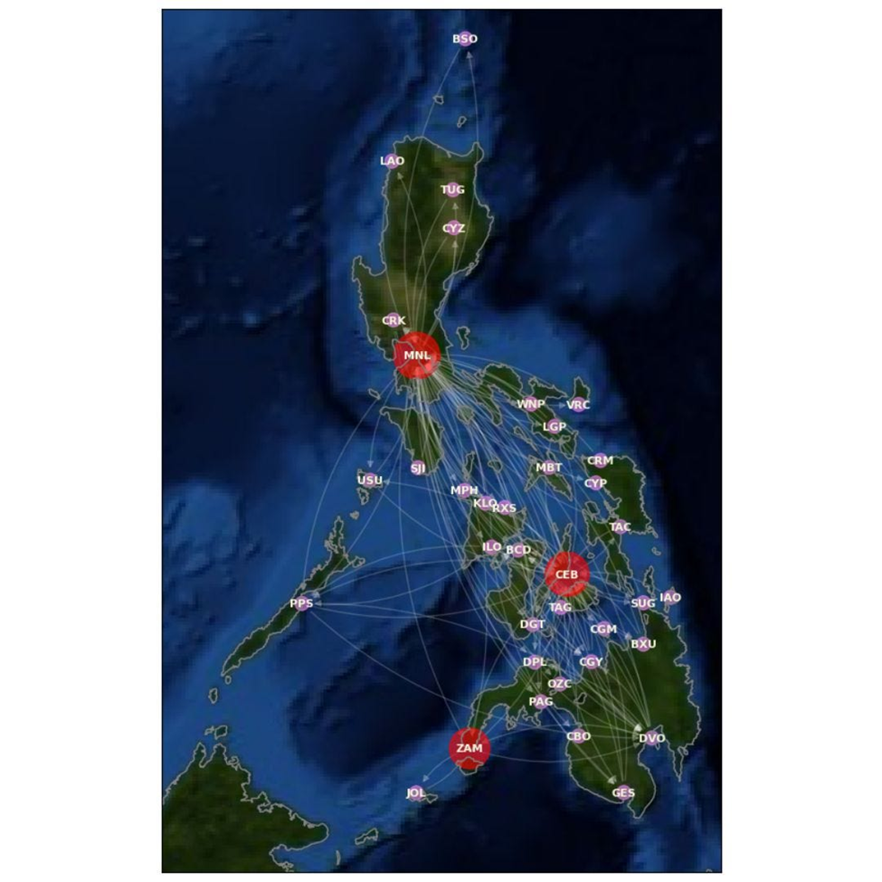
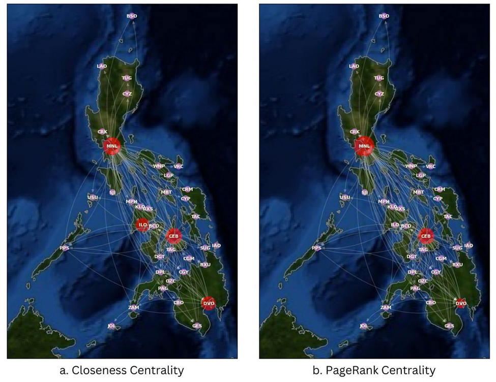
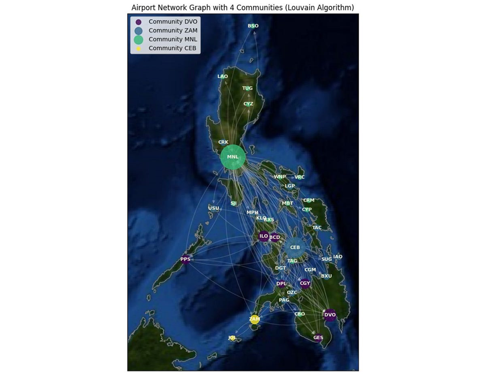
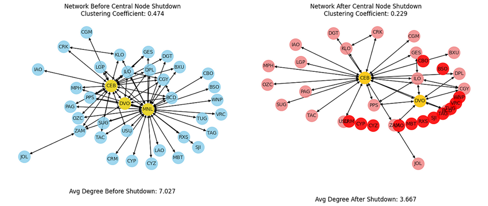
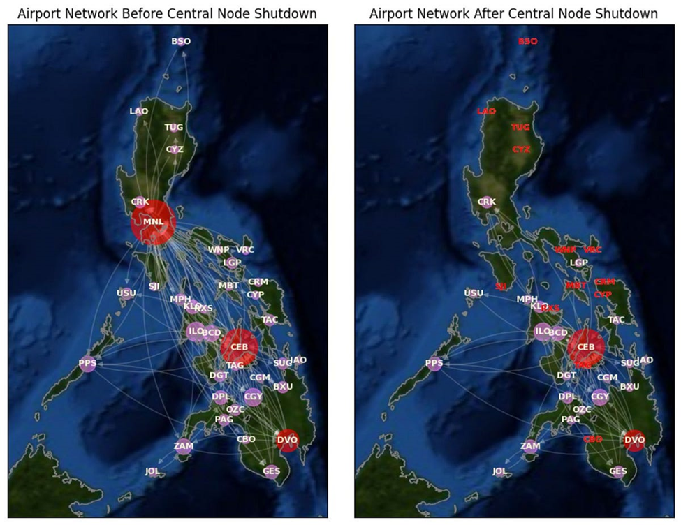

# Unraveling Philippine Aviation: A Comprehensive Analysis through Network Science and Scenario Exploration

## Understanding the consequences of shutting down the busiest airport in the Philippines



Photo Courtesy of Lala Rimando, https://lalarimando.com/

# Introduction

In my years of experience in the aviation industry, I have witnessed a myriad of situations that come with air travel. The commonplace flight delays are something airlines in the Philippines have become adept at handling, both operationally and in customer service. But amidst the usual challenges, I often find myself pondering an unconventional scenario: What if a major airport like the Ninoy Aquino International Airport (NAIA) suddenly ceased operations? While flight disruptions would undoubtedly follow, I can't help but wonder about the broader implications for the other airports across the country. This question isn't just a flight of fancy; it has happened before, with a recent incident marking the beginning of the year, making for a rather memorable New Year's Day. [1]

In this blog, I invite you to join me on an exploration of the captivating world of network science applied to our local airport network, characterized by its hub-and-spoke nature. Together, we will uncover fascinating patterns, from the busiest airports to the shortest routes between any two airports, and delve into the intricate interconnections that shape our aviation landscape. Most notably, we'll embark on an exciting scenario analysis to understand the consequences of shutting down the busiest airport in the Philippines. [8]

This blog is your comprehensive guide to the intriguing realm of airports in the Philippine airspace. Whether you're an aviation professional involved in fleet planning, or simply a frequent traveler or a first-time flyer mapping out your travel itinerary, this wealth of information promises to be an invaluable resource.

# History

Throughout its history, Ninoy Aquino International Airport (NAIA) has faced several significant shutdowns, each leaving a profound impact on air travel in the Philippines.

In January 1972, a **fire destroyed Manila's Airport building**, necessitating the diversion of all domestic and international flights to Mactan, Cebu. [2]

Another **devastating fire swept through Manila's domestic airport** in February 1980, causing substantial damage and destruction. [3]

In 2016, a **power outage plunged the airport into darkness**, resulting in chaos among passengers and a halt to flight operations. [4]

In 2018, a Xiamen Airlines **plane carrying 157 passengers slid off the runway**, leading to the closure of the runway and the cancellation of approximately 165 international and local flights. [5]

The most recent incident occurred in 2023 when the Civil Aviation Authority of the Philippines detected **power issues at the Air Traffic Management Center**. Consequently, all flights were grounded, impacting over 282 flights from various Philippine airports and affecting more than 56,000 passengers who were either traveling to or departing from the country following New Year's Day. [1]

# The Dataset

The Global Air Transportation Network is a comprehensive dataset that includes air travel data, such as information about airports, airlines, routes, and airplanes.

This database contains over 10,000 data points compiled by OpenFlights (https://openflights.org) from a variety of reliable sources. This dataset is maintained and updated regularly by Tyler Woebkenberg (https://data.world/tylerudite).

However, for this discussion, we will focus solely on the Philippine airspace, particularly the airports within this region, and limit our analysis to domestic flights.

You can access the full notebook through my GitHub Repository: https://github.com/BJEnrik/ph_airport_network

# Understanding Degree Centrality: The Busiest Airports

Degree centrality is a fundamental concept in network analysis, it measures the number of direct connections or links an airport has with other airports. The more connections an airport has, the higher its degree centrality and, consequently, the busier it tends to be. [9]


Table 1. Top 10 Busiest Airports in the Philippines.

Taking a closer look at Table 1 (see above), Ninoy Aquino International Airport reigns as the uncontested leader with a high degree centrality score of 1.778. Its high score is indicative of its web of direct connections with other airports in the country.

Degree centrality goes beyond just identifying busy airports; it also sheds light on the pivotal role these airports play in air travel. The higher the degree centrality, the more crucial an airport is for facilitating smooth connections and efficient travel between various destinations. [6]


Figure 1. Airport Network Graph of the Top Three Central Nodes (Degree Centrality).

With the help of NetworkX and Basemap, we can visualize the airport network, and three central nodes, namely MNL, CEB, and DVO, stand out. Interestingly, each of these nodes represents the three major islands in the Philippines: Luzon, Visayas, and Mindanao (See Figures 1 and 2). [7]


Figure 2. Airport Network Graph of the Top Three Central Nodes (Degree Centrality).

Degree centrality not only identifies busy airports but also reveals their crucial role in air travel. The higher the degree centrality, the more vital an airport becomes in ensuring seamless connections and efficient travel between different destinations. [6]

# Understanding Betweenness Centrality: The Shortest Routes Between Any Two Airports

The concept of the shortest route in an airport network, as evidenced by the increasing percentage of reachable airports with a higher number of jumps, is reminiscent of the "six degrees of separation" theory. This theory posits that any two individuals in the world can be connected through a chain of six or fewer social connections. Similarly, in the context of airport networks, it illustrates how well-connected and interlinked airports are, enabling passengers to traverse various destinations within a few hops. As the number of jumps increases, the network reveals its extensive reach, showcasing the efficiency of air travel in bridging distant locations. [7]


Figure 3. The percentage of airports you can reach within n flights.

The increasing percentage of reachable airports with each jump suggests that the airport network in the Philippine domestic space follows a hub-and-spoke model (See Figure 3). This means passengers from different provinces will likely have to transit through these central hubs like MNL, CEB, or DVO to access specific destinations.
To give you more context: I am a Taclobanon, hailing from Tacloban City. To have a delightful vacation in Boracay (MPH), I need to take at least two flights - either TAC-MNL-MPH or TAC-CEB-MPH. Consequently, returning home requires the reverse route, totaling to four flights. It can be quite exhausting. This inherent issue highlights a challenge in our domestic airport network, where direct routes between provinces are limited, and travelers often have to pass through central hubs like MNL and CEB to reach their destinations.


Figure 4. Top three airports with the highest betweenness centrality.

Now imagine if I have to go to JOLO (JOL) from Tacloban (TAC), it will take me 3 flights minimum. A round trip would mean two additional flights, totaling six flights. This inherent complexity in our domestic airport network can be better understood through the concept of betweenness centrality.

In the realm of this betweenness centrality, the most central airports are MNL, CEB, and ZAM (see Figure 4). These airports play a crucial role in the network as they act as major transfer points, connecting various regions in the Philippines. ZAM's high betweenness centrality is particularly noteworthy due to its direct flight route to JOLO, which significantly reduces the number of flights required for passengers traveling between Tacloban and JOLO. Consequently, these central airports streamline travel by minimizing the number of flight transfers and enhancing overall accessibility within the country's domestic airport network. [9]

# Understanding PageRank Centrality: The Most Important Airports

The question of which airports hold the highest importance lies before us. Which of our airports are the most important? What does it mean to be important? To answer the question, it's about the quality of connections they have with other well-connected airports. It reflects the significance of an airport as a critical node, responsible for facilitating the transfer and reception of a substantial volume of air traffic.


Figure 5a (left). Central nodes according to Closeness Centrality. Figure 5b (right). Central nodes according to PageRank Centrality.

Using the PageRank centrality measure, we find that the "highly recommended" airports are MNL, CEB, and DVO, in that order (see Figure 5b). So, if you're planning travels that involve multiple transfers, consider these airports in the suggested order. Their prominence in the PageRank ranking indicates their vital role in ensuring a smoother and more efficient journey with better connections to other significant destinations. [9]

# Community Detection in Airport Networks: A New Era of Data-driven Decisions

In the fast-paced world of aviation, every decision made by airlines can make or break their success. That's why when it comes to route planning and marketing, the game is all about efficiency and delivering an exceptional experience to passengers. But what if there was a groundbreaking approach that could revolutionize their strategies? Enter community detection - a cutting-edge technique with incredible business implications for airlines like Philippine Airlines, Cebu Pacific, and Air Asia.


Figure 6. Community detection using the Louvain algorithm.

The Louvain algorithm used in this study revealed four well-defined clusters of airports (see Figure 6). [10] For these airlines, it opens up new possibilities for route planning and marketing within these clusters. They can conduct market studies to assess the viability of providing direct flights between the spokes, such as TAC-MPH, which caters to the demands of both leisure and business travelers alike.

Moreover, airport authorities can leverage this information to understand which airports act as critical hubs connecting different regions. This knowledge becomes instrumental in making informed decisions regarding infrastructure investments and resource allocation.

Community detection in an airport network holds a significant business value that remains yet to be fully unlocked. It provides airlines and airport authorities with valuable insights into the complex web of air travel connections, empowering them to take their operations to the next level.

You see, it's not just numbers and data. It's about empowering airlines and airport authorities with the right information to take their game to the next level. We're entering a whole new era of data-driven decisions!

# Shutting Down NAIA: Impacts on the Philippine Airspace

Suppose a sudden electrical system failure at Ninoy Aquino International Airport plunges the entire facility into darkness, causing a state of chaos among passengers and staff. Emergency generators struggle to cope with the airport's energy demand, leading to flight diversions to nearby airports. What do you think will happen to the entire network?


Figure 7a (left). Airport network before central node shutdown; Figure 7b (right). Airport network after central node shutdown.

Bedlam! The airport network heavily relies on the availability of MNL, making it a central hub connecting various airports. Consequently, the shutdown of MNL not only affects the airport itself but also impacts other airports that solely rely on flights to and from MNL, represented by the red nodes in Figure 7b. Furthermore, airports connected to multiple central hubs also face halted operations, resulting in substantial revenue losses for both airlines and airports.

This "shutdown effect" becomes evident in the sharp decline of both the average degree of the network and the clustering coefficient. Despite the shutdown being limited to one airport, the average degree drops dramatically from 7.027 to 3.667, and the clustering coefficient decreases from 0.474 to 0.229. These figures underscore the critical role of MNL in the entire airport network and emphasize the widespread impact of its shutdown on the overall system.


Figure 8a (left). Airport network before NAIA (MNL) shutdown. Figure 8b (right). Airport network after NAIA (MNL) shutdown.

For context, when the average degree lowers down, it means that airports have fewer direct connections with other airports, resulting in reduced accessibility.[8] This means that passengers may have fewer options for direct flights and may need to make more layovers or connections to reach their destinations.

Meanwhile, when the clustering coefficient lowers, it means that there are fewer connections between an airport and its neighboring airports.[8] This indicates a loss of interconnectedness within the network, making it more challenging for airports to efficiently transfer passengers between each other. As a result, it may lead to longer travel times, increased flight delays, and less flexibility for travelers in choosing their flight routes.

# Final Words

Understanding the significance of Ninoy Aquino International Airport (NAIA) in our country's air transport system is just the beginning. Not only does NAIA handle a significant portion of domestic flights, but it also caters to a large number of international departures and arrivals, impacting both paying passengers and airlines alike.

The potential repercussions of a shutdown extend beyond revenue loss for airlines. It could lead to the cancellation of fully paid vacations, crucial business meetings, and other essential travel plans. In 2023, the aviation industry is already grappling with numerous challenges, from a surge in canceled flights to technical delays. Adding an airport shutdown to the mix would only exacerbate the situation.

As aviation professionals, we must stay informed and plan to ensure the continued health and operation of our central airports throughout 2023. Let this article serve as a reminder to all airmen, like me, that making informed decisions and formulating robust plans is crucial in keeping our airports running smoothly and serving the needs of passengers and airlines.

Keep your dreams above sea level!

# References

## Airport Shutdown Events

[1] Dela Peña, K. (January 3, 2023). Jan. 1, 2023, the day PH airspace went blank, strips mask off air travel woes, outdated system. INQUIRER.net. Retrieved from https://newsinfo.inquirer.net/1711967/jan-1-2023-the-day-ph-airspace-went-blank-strips-mask-off-air-travel-woes-outdated-system

[2] The New York Times. (January 22, 1972). Fire Destroys Manila's Airport Building, Killing 6. Retrieved from https://www.nytimes.com/1972/01/22/archives/fire-destroys-manilas-airport-building-killing-6.html

[3] The New York Times. (February 11, 1980). Fire Damages Manila Airport. Retrieved from https://www.nytimes.com/1980/02/11/archives/fire-damages-manila-airport.html

[4] Saunar, I. (April 5, 2016). Aiport authorities explain NAIA Terminal 3 power outage. CNN Philippines. Retrieved from http://www.cnnphilippines.com/news/2016/04/05/miaa-explain-naia-3-power-outage.html

[5] Marquez, B. (August 18, 2018). Operation resume as NAIA runway reopens. Philstar Global. Retrieved from https://www.philstar.com/headlines/2018/08/18/1843728/operations-resume-naia-runway-reopens

## Visualization Guide of Airport Networks

[6] Nixon, A. (December 2017). OpenFlights Network Analysis. Github. Retrieved from https://github.com/AlexanderNixon/OpenFlights-Network-Analysis/blob/master/report.ipynb

[7] Doan, T. (June 2018). Catching that flight: Visualizing social network with Networkx and Basemap. Towards Data Science. https://towardsdatascience.com/catching-that-flight-visualizing-social-network-with-networkx-and-basemap-ce4a0d2eaea6

## Network Science

[8] Barabasi, A. (2016). Network Science. Retrieved from http://networksciencebook.com/

[9] Disney, A. (2020). Social network analysis 101: centrality measures explained. Cambridge Intelligence. Retrieved from https://cambridge-intelligence.com/keylines-faqs-social-network-analysis/#:~:text=Centrality%20measures%20are%20a%20vital,that%20might%20need%20more%20attention.

[10] Blondel, V., Guillaume, J., Lambiotte, R., Lefebvre, E. (July 2008). Fast unfolding of communities in large networks. Retrieved from https://arxiv.org/abs/0803.0476


```python

```
